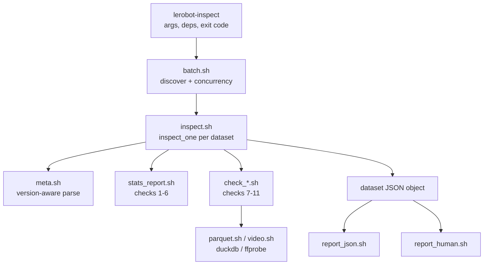

# DESIGN — lerobot-inspect

## Architecture

A thin entrypoint parses arguments and orchestrates; every capability is a small
single-responsibility library. **One JSON object per dataset is the single
source of truth** — both the human report and the `--json` report render from it,
so they can never disagree.

Data flow: `meta_load` parses metadata once into a few globals → `build_stats`
answers the descriptive questions → each registered check emits exactly one
structured result (`{check, status, detail, location}`) built by `jq` → the
results roll up to a `PASS`/`FAIL` verdict → the batch layer aggregates, flags
cross-dataset outliers, and hands the array to a renderer.

**Extensibility (the "add a check on the spot" requirement):** a check is a
function that calls `emit_result` once. To add one, write `lib/check_<name>.sh`,
source it in the entrypoint, and add its name to `INSPECT_CHECKS` in
`lib/inspect.sh`. Nothing else changes.

## Key assumptions

- **Schema.** LeRobot v2.0 (`stats.json`) and v2.1 (`episodes_stats.jsonl`) are
  supported; the file layout follows the `data_path`/`video_path` **templates in
  `info.json`** (tokens are expanded, not hardcoded), with chunk index =
  `episode_index / chunks_size`. Provided datasets are all v2.1.
- **Authoritative sources.** `episodes.jsonl` is the source of truth for which
  episodes exist and their lengths; `info.json`'s `total_*` fields are treated as
  *claims* to be reconciled against the files, never trusted.
- **Stored std is population std** (numpy default, `ddof=0`) — matched with
  duckdb `stddev_pop`; verified against clean data to 6–9 decimals.
- **Frame counts** come from the video stream (`ffprobe`), never the filename.

## Tradeoffs

- **`set -euo pipefail` vs explicit handling.** The brief mandates `errexit`; the
  bash skill prefers explicit checks. Resolved in favor of the brief, with checks
  written so expected non-zero results (a failed duckdb read, a zero-valued
  `(( ))`) are always guarded — otherwise they would abort a run.
- **Speed vs accuracy on video.** Default `--frame-mode fast` reads the container
  `nb_frames` header (~12× faster: 501 videos in ~75 s vs ~15 min). It falls back
  to a full decode when the header is absent; `--frame-mode exact` forces decode.
- **Glob query vs per-file.** Row counts, timing and stats are read in one duckdb
  query per dataset for speed. Because a single corrupt parquet aborts a globbed
  read, each such check **falls back to per-episode reads** — this both pinpoints
  the corrupt file and keeps validating the healthy ones (so a truncated parquet
  can't mask a perturbed stat elsewhere). Cost: one bad file makes that dataset
  scan per-file.
- **Severity policy.** Structural corruption (missing/orphan files, truncated
  parquet, non-monotonic timestamps, count mismatches, out-of-tolerance stats) is
  `FAIL`. Rate jitter and dropped-frame gaps — which occur naturally in real
  captures — are `WARN`, surfaced but promotable to `FAIL` with `--strict`.
- **Image-feature stats are not recomputed:** their pixels live in the mp4s, not
  the parquet, so only numeric columns (`observation.state`, `action`) are
  validated. Stated explicitly rather than silently skipped.

## What I'd improve

- Verify **actual** vs declared video resolution and codec (currently declared
  resolution is reported; only frame *count* is cross-checked).
- Parse the `data_path`/`video_path` printf widths from the template instead of
  assuming the standard `%03d`/`%06d`.
- A resumable/streaming mode and a progress bar for very large batches; cache
  `ffprobe` results keyed by (path, mtime).
- Richer cross-dataset anomaly detection (episode-length and duration outliers,
  not just fps) using the `detecting-data-anomalies` methodology.
- A `--check <name>` selector to run a subset of checks.
